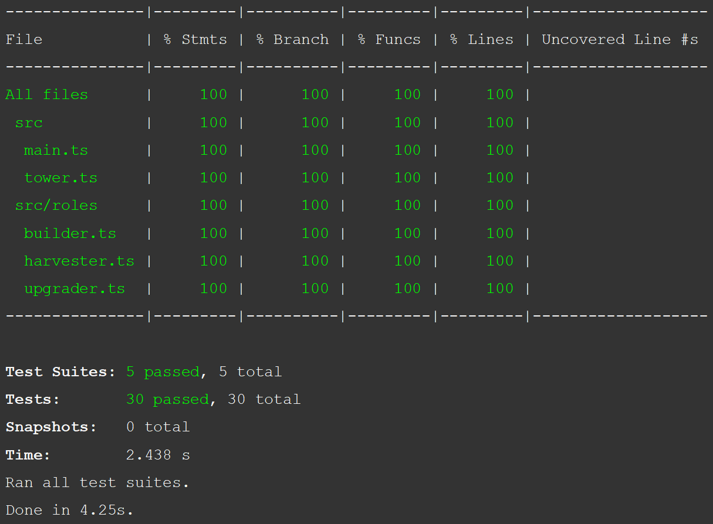

# Screeps Fearless Automatons

[Screeps](https://screeps.com/) bot

with [Jest](https://jestjs.io/).

This was forked from the Typescript and Jest starter repository.

For anything else, go to [the original repository](https://github.com/screepers/screeps-typescript-starter).

